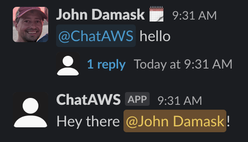
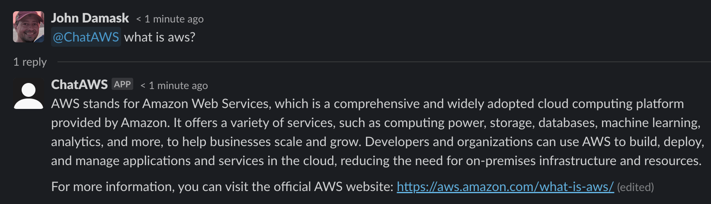

# ChatAWS Slack

## Description

ChatAWS Slack is a GPT-backed chatbot that integrates with Slack. It's like having your own AWS expert available 24/7. Forget about Googling, reading AWS documentation or spelunking old Stack Overflow posts, just ask @ChatAWS!

## Features

- GPT-powered: Get intelligent, human-like responses thanks to GPT-4
- Serverless: Runs on AWS Fargate. This means it's always on and there's no infrastructure to manage
- Easy to use: Just type @ChatAWS in Slack

## Examples


## Prerequisites

- Slack
    - Slack workspace with administrator or owner permissions

- OpenAI
    - OpenAI account with API access
    - OpenAI API key

- AWS
    - AWS Account configured with a VPC and private subnet
    - AWS IAM user with administrator permissions (you'll need the API key)
    - AWS CLI installed and configured with your AWS API key

- Docker
    - Docker installed and running locally

- Python 3.10 or greater

- Ability to execute bash shell scripts


## Installation & Configuration

There are three major parts to this application that need to be configured in the following order:

### 1. Slack app creation
- Login to your Slack workspace
- Follow Slack's [Basic app setup guide](https://api.slack.com/authentication/basics)
    - Click the Create a new Slack app button on the page above. 
    - This will take you to the https://api.slack.com site for configuring your app
- Specific configuration for this app:
    - App token:
        - Click, Generate Tokens and Scopes
            - Name: ChatAWSSocketToken
            - Scope: connections:write
        - Save the token. You'll need it later
    - Bot token:
        - Navigate to Oauth & Permissions. Add the following Scopes:
            - app_mentions:read
            - channels:history
            - channels:read
            - chat:write
            - groups:history
            - groups:read
            - im:history
            - im:read
            - links:read
            - mpim:history
            - mpim:read
            - mpim:write
        - Click Request to Install 
        - After the app has been approved by your workspace administrator, click the Install to Workspace button and click Allow 

            
        - You can now get your bot user access token under the Oauth & Perissions sidebar. Save it in a safe place (**do not put this in source control**)
- Next, you need to invite your app to a channel. Go to a channel of your choice and type `/invite`

    
- Search for ChatAWS and click Add
- Verify you can call it by typing `@ChatAWS`. It won't do anything yet.
- Verify the app can write to the channel. 
    - Get the Slack channel id for the channel you just invited the bot to (you can find this in Slack by clicking the drop down your channel name and scrolling to the bottom)
    - Post a message
        ```
        curl -X POST -F channel=<channel ID> -F text="ChatAWS ready to go" \
        https://slack.com/api/chat.postMessage \
        -H "Authorization: Bearer <Slack bot token>"
        ```
- Now you need to configure your app to listen for events (again, this is done via https://api.slack.com)
    - The app communicates over websockets, so you'll first need to enable socket mode.
        - Navigate to Socket Mode
        - Click "Enable Socket Mode"
    - In the https://api.slack.com page for your ChatAWS app, navigate to Event Subscriptions and click the Enable Events toggle
    - Subscribe to the following events:
        - app_mention
        - message.channels
        - message.groups
        - message.im
        - message.mpim
    - Click Save Changes button
- Go to the Slack channel where you invited your new app and type `@ChatAWS hello`. You should get a friendly response 

    

### 2. Code configuration
*Note these instructions are for a Mac. You may have to tweak if running on Windows or other systems*
- Download latest release or clone this repo into a local folder with a python virtual environment
    ```
    git clone https://gitlab.com/flagship-informatics/flagship-digital/aws/chataws-slack.git
    cd chataws-slack
    chmod +x scripts/*.sh
    ```
- It's a good idea to try your application locally, which can be done using the handy localapp.py script provided:
    ```
    # Create virtual Python environment to isolate this project from your global Python
    python -m venv .venv
    source .venv/bin/activate
    pip install -r requirements.txt
    # Set local environment variables. Here's how to do it on a Mac
    export SLACK_BOT_TOKEN_CHATAWS=<bot token>
    export SLACK_APP_TOKEN_CHATAWS=<app token>
    export OPENAI_API_KEY_CHATAWS=<openai api key>
    python localsrc/localapp.py
    ```

- If everything went well, you'll be able to call the app from Slack

    

Did you make it here? Sweet. Go ahead and stop localapp.py by hitting Ctrl c and read on.

### 3. Docker build and AWS configuration

A production Slack application shouldn't run on your laptop; it should run in a container in your AWS account. This section will walk you through creating a Docker image, publishing it to an AWS Elastic Container Registry (ECR) repository and running it as a serverless application that's always on.

- Create your AWS Elastic Container Repository (ECR), your Docker image and push the image to your new repo
    
    ``` 
    ./scripts/create_ECR_repo_and_push_container.sh
    Enter your repository name: chat-aws-slack
    Enter your region: \<your AWS region\>
    Enter your account ID: <your account id>
    ```

    This will take a couple of minutes to run (if you encounter an error, paste it into ChatGPT and see if you can troubleshoot). When finished, get the URI for the repo and save it for later

    ```
    aws ecr describe-repositories --repository-names chat-aws-slack --query 'repositories[0].repositoryUri' --output text
    ```

- Write your OpenAI API key and Slack bot and app tokens to AWS Secrets Manager.
    ```
    ./scripts/create_secrets.sh
    ```
    Copy the ARNs for each secret, you'll need them later

You're now ready to create an AWS Elastic Container Service that will pull your image from ECR and run it. We use AWS Fargate so there's no need to manage EC2s. 

- Open the AWS Management Console and login
- Navigate to CloudFormation and create a stack with new resources using the file `cloudformation/chataws_fargate.yml`
    - Stack name: chat-aws-slack
    - Paste in values from what you created earlier for
        - EcrRepositoryUri
        - OpenAIAPISecretArn
        - SlackAppSecretArn
        - SlackBotSecretArn
    - Choose your vpc and private subnet IDs
    - Follow through the rest of the CloudFormation wizard. Add the Tag `AppName:ChatAWS Slack`, otherwise just leave the defaults and keep clicking Next
    - Check the box acknowledging that the script creates IAM resources and slick Submit
- Monitor Events in the CloudFormation console. After a few minutes, the status should read CREATE_COMPLETE. If you see errors, go through the Events that caused them and ensure you didn't have any missteps. One common error is that the ARN for your secrets was wrong.

- Write the provided system prompts to DynamoDB
    ```
    ./scripts/load_systems_prompts_into_ddb.sh
    ```


## FAQ
- Does OpenAI use my input? 
    - Per [OpenAI's API Data Usage policy from May 2023](https://openai.com/policies/api-data-usage-policies) OpenAI will not use your conversations to train their models. Still, it's up to you to abide by any constraints or policies set by your organization.
- Does ChatAWS remember my chats? 
    - Yes. Though this hasn't been thoroughly tested. The code responds in Slack threads and each call to the OpenAI API includes the thread history. Chats from different threads don't appear to bleed into one another.
- Does it hallucinate?
    - Yes. But perhaps not as much as regular ChatGPT. This happens mostly with URLs it provides in the response. The model is told to validate all links before providing them to the user but it doesn't always work.
- How much can I use it?
    - You can use it until you hit API call limits for [GPT-4](https://platform.openai.com/docs/guides/rate-limits/overview), then you'll have to cool your jets for a while. This could become a real pain if the app is being used by multiple people in your organization (which is likely considering it's a Slack bot).
- How do I redeploy the Docker image if I want to change something?
    - Execute the last two lines in `scripts/create_ECR_repo_and_push_container.sh`
    - Update the Elastic Container Service that runs this code using the AWS Management Console or CLI. 
- Why not just use ChatGPT?
    - You certainly can, but here are a few reasons why you may want to use this:
        - This code uses a "system message" that tells GPT4 to behave as an AWS expert and provides a framework for the model to think through answers. Sometimes, it's responses are better than ChatGPT but not always. Try it for yourself.
        - Sometimes you just want to access ChatGPT without logging into their website. @ChatAWS is always listening.
        - Everyone on a Slack channel where @ChatAWS is installed can see the chats. This can be helpful if you're sharing information between team members.
- Can I change the system prompt?
    -  Yes! This project provides three examples of prompts to turn GPT4 into different types of experts. You can add your own and see how they work by changing the get_prompt() method in utils.py. 

## How it's Built
This project leverages the [Bolt-Python](https://slack.dev/bolt-python/tutorial/getting-started) framework for building Slack applications, and uses code from the [Slack GPT Bot](https://github.com/alex000kim/slack-gpt-bot) project and the deeplearning.ai course, [Building Systems with the ChatGPT API](https://learn.deeplearning.ai/chatgpt-building-system/lesson/1/introduction).

### Architecture


---
<!-- CONTRIBUTING -->
## Contributing to this project
Glad to see you want to make this project better! One crucial thing to keep in mind is that parameters are required for the program to execute. Feel free to add any features you think will be helpful but make sure to parameterize them. That is to say, don't change the default behavior of the program.

Direct all discussions around new feature, bugs, etc to the #fsp-innersource Slack channel on the Flagship Network workspace. 

### Source code conventions
Since the development team is small and all members of the project, __code modifications are managed via issues and branches instead of forks__. Please follow these steps if you want to join in.

#### Warning: Don't code directly against master branch

1.	Clone the Main branch of the project to your development computer.
2.	Browse project Issues in GitLab and create one if necessary - consider discussing on the Slack channel. Assign to yourself if you intend to code it up or ask first if you want to assign it to someone else.
3.	To start work on an Issue, open it and look for the green button that says, “Create merge request”. Click the drop-down arrow and select, “Create branch”; GitLab will name the branch for you (don’t change this). Copy the branch name to your clipboard and click the “Create branch” button.
4.	From your development computer, create a local branch of the same name, e.g. `git checkout -b 14-add-how-to-contribute-section-to-readme`.
5. Code away, committing and pushing to the branch as you go.
6. When the work is done, make sure your last commit comment specifies the issue is closed, e.g. `git commit -m "Closes Issue #13"`go to the Issue in the browser and click the "Create merge request" button.
7. Use your judgement if you feel the code needs to be reviewed by someone else. If so, add at least one reviewer and ping them on Slack to let them know you're waiting on them.
8. Typically, only a member of the Flagship Digital engineering team should accept merge requests to the Main branch.
8. Keep the default setting of deleting the branch on merge.
9. Once merged, you can delete your local copy of the branch.
10. Tell people about your change on Slack.