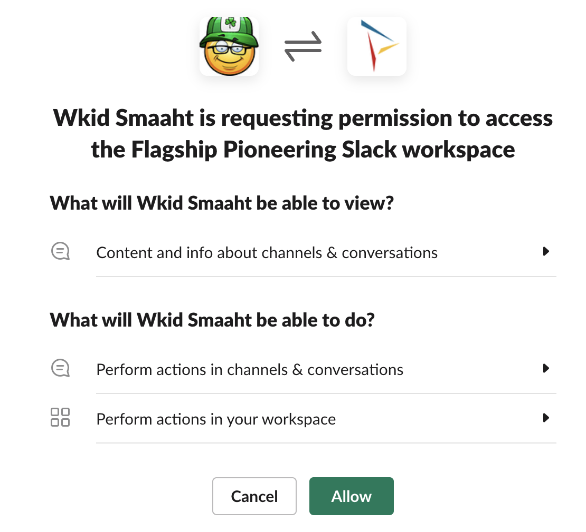
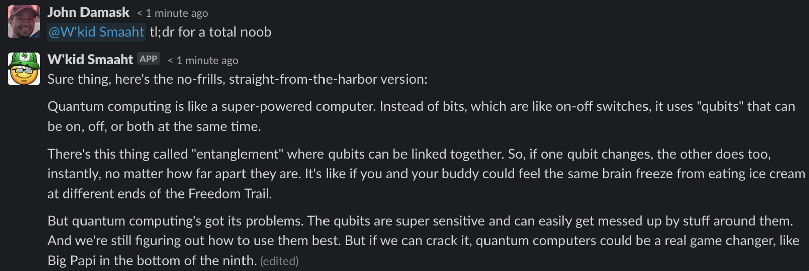
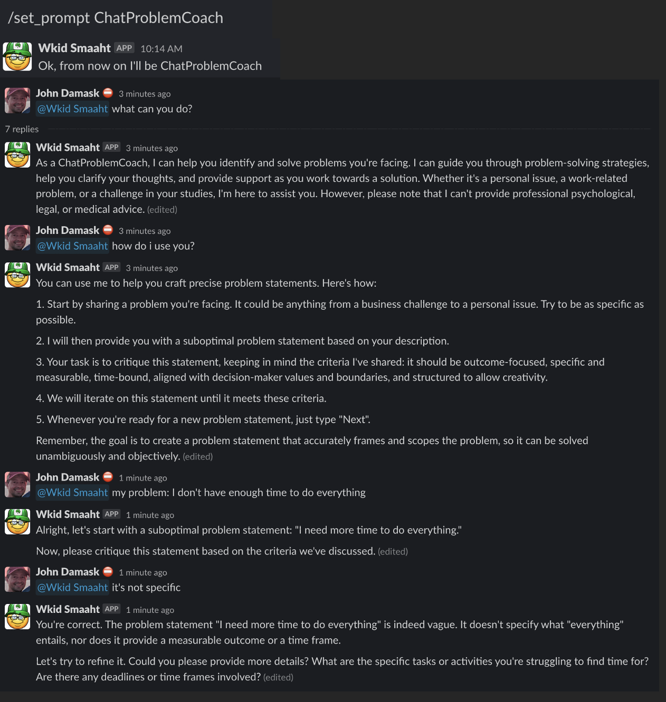

# W'kid Smaaht 

## Description

Wait...what?

"Wicked smart" is a phrase you'll hear a lot around Boston. It's our way of saying someone is extremely intelligent. It's like if Albert Einstein, Tom Brady, Ketanji Brown Jackson and HAL 9000 had a baby, that kid would be "wicked smaaht".

W'kid Smaaht Slack brings the power of GPT4 to Slack. It's like having an expert in any topic available 24/7. 

## Features

- GPT-powered: Get intelligent, human-like responses thanks to GPT-4
- Serverless: Runs on AWS Fargate. This means it's always on and there's no infrastructure to manage
- Easy to use: Just type @Wkid Smaaht in Slack

    

## Prerequisites

- Slack
    - Slack workspace with administrator or owner permissions

- OpenAI
    - OpenAI account with API access
    - OpenAI API key

- AWS
    - AWS Account configured with a VPC and private subnet
    - AWS IAM user with administrator permissions (you'll need the API key)
    - AWS CLI installed and configured with your AWS API key

- Docker
    - Docker installed and running locally

- Python 3.10 or greater

- Ability to execute bash shell scripts

- jq
    - See [this gist](https://gist.github.com/magnetikonline/58eb344e724d878345adc8622f72be13) if installing on an Mac M1 with ARM64 chip


## Installation & Configuration

There are three major components to this application: the code, the AWS environment to run it and the Slack app itself. Start by downloading the codebase:

*Note these instructions are for a Mac. You may have to tweak if running on Windows or other systems*
- Download latest release or clone this repo into a local folder with a python virtual environment
    ```
    git clone https://github.com/jbdamask/wkid-smaaht.git
    ```

- Set shell scripts to executable
    ```
    cd wkid_smaaht
    chmod +x scripts/*.sh
    ```

### Slack app creation
- Login to your Slack workspace online. You can create one for free if you don't have one.
- Follow Slack's [Basic app setup guide](https://api.slack.com/authentication/basics)
    - Click the Create a new Slack app button on the page above. 
    - This will take you to the https://api.slack.com site for configuring your app. 
        - Click "Create New App" button
        - Choose to create an app **from an app manifest**.
        - Choose a Slack workspace for your app
        - Select YAML and paste the contents of `slack-app-manifest.yml' in the input field. Click *Next*
        - In order to enable DM's to your app you'll need to check the box under App Home (Note: If Slack tells you that "Sending messages to this app has been turned off" after completing this full installation, restart Slack)

            

        - To set the Slack App icon, look for the Add App Icon under Basic Information. Upload `images/wkid_smaaht_small.jpg`       
    
    - Click Install to Workspace (or Request to Install if you're not a Slack admin)    
 
    - Click Allow 

        

    - Get Slack App and Bot tokens
        - Under Basic Information, scroll down to App-Level Tokens and click Generate Token and Scopes
            - Token Name: WkidSmaahtAppToken
            - Permission: connections:write
            - Click the Generate button
            - Copy the token to a safe place; you'll need it later
        - Go to Oauth & Perissions sidebar and look for Bot User OAuth Token. Copy and store for later
- Next, you need to invite your app to a channel. Go to a channel of your choice and type `/invite`

    
- Search for Wkid Smaaht and click Add

    
- Verify you can call it by typing `@Wkid Smaaht`. It won't do anything yet.
- Verify the app can write to the channel. 
    - Get the Slack channel id for the channel you just invited the bot to (you can find this in Slack by clicking the drop down your channel name and scrolling to the bottom)
    - Open a Terminal window on your computer and post a message from Wkid Smaaht
        ```
        curl -X POST -F channel=<channel ID> -F text="Wkid Smaaht ready to go" \
        https://slack.com/api/chat.postMessage \
        -H "Authorization: Bearer <Slack bot token>"
        ```
    
        

    If all looks good, move on to the next section.

### Code configuration

- It's a good idea to try your application locally; you'll find code for this under the localsrc folder. Go back to your computer terminal and make sure you're in the wkid_smaaht folder.

    ```
    python -m venv .venv
    source .venv/bin/activate
    pip install -r requirements.txt
    ```

- Open .env_TEMPLATE and save as .env. Then set the values accordingly. ***IMPORTANT: The .gitignore file for this project specifies that the file ".env" be excluded from upload. But if you add your keys to the .env_TEMPLATE file and check in your code, your keys will be in your git repo!***

- Now run the app

    ```
    python localsrc/localapp.py
    ```

- If everything went well, you'll be able to call the app from Slack

    

Did you make it here? Sweet. Go ahead and stop localapp.py by hitting Ctrl c and read on...or just keep asking it things; some responses are pretty funny.

### Docker build and AWS configuration

A production Slack application shouldn't run on your laptop, but it can run in a container in your AWS account. This section will walk you through creating a Docker image, publishing it to an AWS Elastic Container Registry (ECR) repository and running it as a serverless application that's always on.

- Create your AWS Elastic Container Repository (ECR), your Docker image and push the image to your new repo
    
    ``` 
    ./scripts/create_ECR_repo_and_push_container.sh
    Enter your AWS account ID: <your account id>
    Enter your AWS region: \<your AWS region\>
    ```

    This will:

        1. Create an Elastic Container Registry repo called "wkid-smaaht-slack"
        2. Build an image from the dockerfile
        3. Push the image to the ECR repo
    It can take a couple of minutes to run. When finished, note the URI for the repo and save it for later

    ```
    aws ecr describe-repositories --repository-names wkid-smaaht-slack --query 'repositories[0].repositoryUri' --output text
    ```

- Write your OpenAI API key and Slack bot and app tokens to AWS Secrets Manager. Use the same values you put into your .env (that file is only used for local testing)
    ```
    ./scripts/create_secrets.sh
    ```
    Copy the ARNs for each secret, you'll need them later

You're now ready to create an AWS Elastic Container Service that will pull your image from ECR and run it. We use AWS Fargate so there's no need to manage EC2s. 

- Open the AWS Management Console and login
- Navigate to CloudFormation and create a stack with new resources using the file `cloudformation/wkid_smaaht_fargate.yml`
    - Stack name: chat-aws-slack
    - Paste in values from what you created earlier for
        - EcrRepositoryUri
        - OpenAIAPISecretArn (NOTE: THIS IS THE SECRETS MANAGER RECORD ARN, NOT THE TOKEN)
        - SlackAppSecretArn (NOTE: THIS IS THE SECRETS MANAGER RECORD ARN, NOT THE TOKEN)
        - SlackBotSecretArn (NOTE: THIS IS THE SECRETS MANAGER RECORD ARN, NOT THE TOKEN)
    - Choose your vpc and private subnet IDs
    - Follow through the rest of the CloudFormation wizard. Add the Tag `AppName:Wkid Smaaht Slack`, otherwise just leave the defaults and keep clicking Next
    - Check the box acknowledging that the script creates IAM resources and slick Submit
- Monitor Events in the CloudFormation console. After a few minutes, the status should read CREATE_COMPLETE. If you see errors, go through the Events that caused them and ensure you didn't have any missteps. One common error is that the ARN for your secrets was wrong.

- Write the provided system prompts to DynamoDB
    ```
    ./scripts/load_system_prompts_into_ddb.sh
    ```
- It's time to start the service
    ```
    ./scripts/start_ECS_service.sh
    ```

- When this returns you're (finally) ready to use the app

    

## Uses

You can use Wkid Smaaht for almost anything you'd use ChatGPT for. Almost. There's no web browsing or plugin access, yet:

### Practical


### Accelerated comprehension

If you've been part of a long Slack thread that you want to summarize, just ask Wkid Smaaht:


Or if the thread is really long, and you're feeling lazy, just say tl;dr.


(note that this feature may not work on old threads or threads that W'kid Smaaht hasn't participated in)

<!-- Or let's say you've jumped into a fascinating Slack thread where colleagues are talking about things way our of your comfort zone. You can hit it with something like this:

 -->

### Creativity


You can even use it to create images using OpenAI's DALL E 2:


## FAQ
- Does OpenAI use my input? 
    - Per [OpenAI's API Data Usage policy from May 2023](https://openai.com/policies/api-data-usage-policies) OpenAI will not use your conversations to train their models. Still, it's up to you to abide by any constraints or policies set by your organization.
- Does Slack use my input?
    - Slack chats are considered Customer Data, which Slack's policies state are [owned by the Customer](https://slack.com/trust/data-management). 
- Does Wkid Smaaht remember my chats? 
    - Yes. Though this hasn't been thoroughly tested. The code responds in Slack threads and each call to the OpenAI API includes the thread history. Chats from different threads don't appear to bleed into one another.
- Does it hallucinate?
    - Yes. But since this is GPT4, it's somewhat[better than GPT3](https://openai.com/research/gpt-4)
- How much can I use it?
    - You can use it until you hit API call limits for [GPT-4](https://platform.openai.com/docs/guides/rate-limits/overview), then you'll have to cool your jets for a while. This could become a real pain if the app is being used by multiple people in your organization (which is likely considering it's a Slack bot).
- How do I redeploy the Docker image if I want to change something?
    - Re-run `scripts/create_ECR_repo_and_push_container.sh`
- How can I add a System message?
    - The easiest way to do this is to create a new text file in the `gpt4_system_prompts` folder and re-run `./scripts/load_system_prompts_into_dbb.sh`. See the Advanced section of this README for more info.
- Why not just use ChatGPT?
    - You certainly can, but here are a few reasons why you may want to use this:
        - This code uses a "system message" that tells GPT4 to behave as an AWS expert and provides a framework for the model to think through answers. Sometimes, it's responses are better than ChatGPT but not always. Try it for yourself.
        - Sometimes you just want to access ChatGPT without logging into their website. @Wkid Smaaht is always listening.
        - Everyone on a Slack channel where @Wkid Smaaht is installed can see the chats. This can be helpful if you're sharing information between team members.
- Is there anything not to love?
    - Yep. A bunch of stuff starting with:
        - You may hit GPT4 API limits
        - You may need to restart the service using `./scripts/start_ECS_service.sh` if the bot stops responding in Slack
        - This bot hasn't been stress-tested so if you have many users in Slack, things may bonk out.
        - It can't search the internet
        - It doesn't handle large inputs well
        - Most likely, this will be superceded by Slack's own ChatGPT integration.
        - Standard rules of using LLMs apply, namely that you should always review responses for accuracy, completeness and bias.


## Advanced

This bot can change! When using GPT4 you can steer how it thinks and responds using something called "System messages". System messages are meant to provide additional context or instructions for the AI model. They can be used to specify certain behaviors or to provide additional context that may not be clear from the user's input alone.

It's important to note that while system messages can provide useful context and direction, they may not always perfectly control the AI's behavior. The AI doesn't understand these instructions in the way a human would, but instead treats them as part of the overall pattern of input it uses to generate a response. It's also worth noting that very specific or complex instructions might be more difficult for the AI to follow accurately.

Wkid Smaaht is a good testing ground for creating and refining System messages to see what works.  This app stores several System messages in DynamoDB and exposes them to Slack via slash commands. 


When changed, the personality of the new bot will be specific to your user and channel and persist until you change it again. 



You can add your own system prompts to the DynamoDB table and they'll automatically appear in Slack.

Resources to learn more about "prompt engineering" and system messages.

- [Best practices for prompt engineering with OpenAI API](https://help.openai.com/en/articles/6654000-best-practices-for-prompt-engineering-with-openai-api)
- [ChatGPT Prompt Engineering for Developers](https://www.deeplearning.ai/short-courses/chatgpt-prompt-engineering-for-developers/)


## How it's Built
This project leverages the [Bolt-Python](https://slack.dev/bolt-python/tutorial/getting-started) framework for building Slack applications, and uses code from the [Slack GPT Bot](https://github.com/alex000kim/slack-gpt-bot) project and the deeplearning.ai course, [Building Systems with the ChatGPT API](https://learn.deeplearning.ai/chatgpt-building-system/lesson/1/introduction).

### Architecture


---
<!-- CONTRIBUTING -->
## Contributing to this project
Glad to see you want to make this project better! One crucial thing to keep in mind is that parameters are required for the program to execute. Feel free to add any features you think will be helpful but make sure to parameterize them. That is to say, don't change the default behavior of the program.

Direct all discussions around new feature, bugs, etc to the #fsp-innersource Slack channel on the Flagship Network workspace. 

### Source code conventions
Since the development team is small and all members of the project, __code modifications are handled via issues and their related branches__. Please follow these steps if you want to join in.

To contribute, follow (GitHub guidelines)[https://docs.github.com/en/get-started/quickstart/contributing-to-projects]